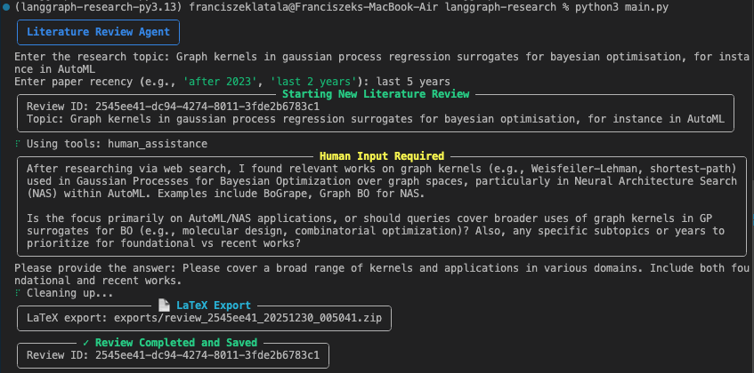
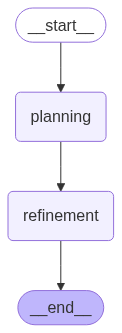
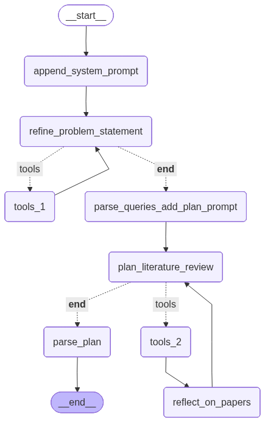
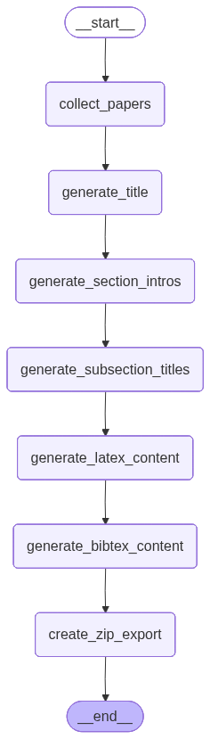

# Literature Review Agent

An autonomous multi-agent system built with LangGraph that generates comprehensive, grounded literature reviews from academic papers. Given a research topic, it searches the web and arXiv, plans the review structure, retrieves and synthesizes relevant papers, and produces a citation-verified literature survey ready for LaTeX export.

---

## Example Usage

<p align="center">
  
</p>

The Literature Review Agent automates the entire academic literature review process:

1. **Input**: You provide a research topic and paper recency filter
2. **Process**: The agent searches for papers, creates a structured plan, writes grounded content with proper citations
3. **Output**: A complete literature survey exported as a LaTeX project

### Example Output

- **[example_review.zip](docs/example_review.zip)** - A complete LaTeX project that can be imported into Overleaf or any LaTeX editor. Contains the `.tex` file, bibliography (`.bib`), and all necessary components for compilation.
- **[example_review.pdf](docs/example_review.pdf)** - The rendered PDF output, showing the final formatted literature review with proper citations and academic formatting.

---

## Overall Architecture

<p align="center">
  
</p>

The system is composed of three sequential sub-agents orchestrated by a parent graph:

1. **Planning Agent** - Refines the research topic, searches for relevant papers, and creates a structured review plan
2. **Refinement Agent** - Writes each subsection using RAG, verifies grounding against source papers, and iteratively refines until quality standards are met
3. **Overleaf Agent** - Transforms the completed review into a LaTeX-ready project with proper formatting and BibTeX bibliography

Each agent operates autonomously within its domain while passing structured state to the next stage. The architecture ensures that every claim in the final output is traceable back to its source paper.

---

## Planning Agent

<p align="center">
  
</p>

### Purpose
The Planning Agent transforms a research topic into a comprehensive, actionable review plan with curated paper assignments.

### Flow
1. **Topic Refinement** (`refine_problem_statement`) - Interacts with the user via human-in-the-loop to clarify scope, focus areas, and constraints
2. **Paper Discovery** (`tools_1`, `tools_2`) - Searches arXiv and the web for relevant papers using multiple queries
3. **Reflection** (`reflect_on_papers`) - Analyzes discovered papers to identify themes and coverage gaps
4. **Plan Creation** (`plan_literature_review`) - Generates a structured outline with sections, subsections, and key points
5. **Paper Assignment** (`parse_plan`) - Maps specific papers to each subsection based on relevance

### Tools Used
| Tool | Purpose |
|------|---------|
| `arxiv_search` | Queries arXiv API for academic papers with title, abstract, and metadata |
| `web_search` | Uses Tavily API for broader web search covering recent developments and industry trends |
| `human_assistance` | Enables interactive clarification with the user for topic refinement |

### Why These Tools?
- **arXiv** provides authoritative academic sources with structured metadata
- **Tavily** captures recent developments not yet in academic literature
- **Human-in-the-loop** ensures the review direction matches user intent

---

## Refinement Agent

<p align="center">
  
</p>

### Purpose
The Refinement Agent generates high-quality, grounded content for each subsection through an iterative write-review-refine loop.

### Flow
1. **Initialization** (`initialise_refinement_progress`) - Sets up progress tracking and prepares subsection queue
2. **Context Preparation** (`prepare_subsection_context`) - Downloads assigned papers, creates vector embeddings, retrieves relevant segments
3. **Writing** (`write_subsection`) - Generates subsection content using RAG with retrieved paper fragments
4. **Grounding Review** (`review_grounding`) - Verifies each citation is properly supported by source material
5. **Grounding Refinement** (`process_grounding_feedback`) - Fixes hallucinations or unsupported claims
6. **Content Review** (`review_content`) - Evaluates writing quality (flow, clarity, conciseness, grammar)
7. **Content Refinement** (`process_content_feedback`) - Improves writing without changing verified facts
8. **Iteration** (`advance_to_next`) - Proceeds to next subsection or completes

### Tools Used
| Tool | Purpose |
|------|---------|
| `search_paper_fragments` | Searches ChromaDB vector store for relevant evidence within specific papers |

### The Review Loop
Each subsection goes through two review stages:
- **Grounding Review**: Ensures no hallucinations - every claim must be traceable to source material
- **Content Review**: Ensures writing quality meets academic standards

If either review fails, the content is refined and re-reviewed until it passes or hits the retry limit.

---

## Overleaf Export Agent

<p align="center">
  
</p>

### Purpose
The Overleaf Agent transforms the completed literature survey into a publication-ready LaTeX project.

### Flow
1. **Paper Collection** (`collect_papers`) - Gathers all cited papers and their metadata
2. **Title Generation** (`generate_title`) - Creates an appropriate academic title for the survey
3. **Section Introductions** (`generate_section_intros`) - Writes connecting prose for each major section
4. **Subsection Titles** (`generate_subsection_titles`) - Converts key points into proper academic headings
5. **LaTeX Generation** (`generate_latex_content`) - Formats all content with proper LaTeX structure
6. **BibTeX Generation** (`generate_bibtex_content`) - Creates bibliography entries for all cited papers
7. **Export** (`create_zip_export`) - Packages everything into an Overleaf-compatible ZIP file

### Output Contents
The exported ZIP includes:
- `main.tex` - Complete LaTeX document with proper structure
- `references.bib` - BibTeX bibliography with all cited papers
- Ready for direct import into Overleaf or any LaTeX editor

### Citation Conversion
Citations in the format `[Author_YEAR(ArxivID)]` are automatically converted to proper `\cite{key}` commands with corresponding BibTeX entries.

---

## Data Layer

The system uses a robust data layer to manage papers, reviews, and vector embeddings:

### SQLite Database
Stores structured metadata including:
- **Reviews**: Topic, status, configuration, timestamps
- **Plans**: JSON-serialized review structure
- **Papers**: arXiv ID, title, authors, abstract, URL
- **Sections/Subsections**: Content, completion status
- **Review-Paper Links**: Which papers are used in which subsections
- **Vector Collections**: Tracking of embedded paper chunks

### ChromaDB Vector Store
Each paper is:
1. Downloaded from arXiv
2. Chunked into segments (configurable size/overlap)
3. Embedded using the configured embedding model
4. Stored in a per-paper collection for efficient retrieval

This enables semantic search within papers during writing and grounding verification.

### Temporary Cache
Papers are temporarily cached during processing to avoid redundant downloads. The cache is cleaned up after each review is complete.

---

## Why Grounding Matters

**Grounding** is the process of ensuring that every claim in the generated text is directly supported by evidence from source papers. This is critical for academic writing because:

### The Problem with LLM-Generated Content
LLMs can "hallucinate" - generate plausible-sounding but fabricated information. In academic writing, this means:
- Made-up statistics or findings
- Misattributed claims
- Citations that don't support the stated claims

### How Grounding is Achieved

1. **Evidence-Based Writing**: The writing agent only has access to specific paper segments retrieved via RAG. It cannot invent content beyond what's in the provided fragments.

2. **Citation Verification**: After writing, each citation is automatically verified:
   - The claim being supported is extracted
   - Relevant fragments from the cited paper are retrieved
   - An LLM verifies the claim is actually supported

3. **Iterative Refinement**: If a claim is found to be:
   - **Hallucinated**: It's removed or replaced with actual findings
   - **Contradicted**: It's corrected to match the source

4. **Tool Access for Verification**: The grounding reviewer has access to `search_paper_fragments` to find additional evidence, ensuring thorough verification.

This multi-stage verification ensures the final output is trustworthy and academically sound.

---

## Installation

```bash
# Clone the repository
git clone <repo-url>
cd langgraph-research

# Install dependencies with Poetry
poetry install

# Set up environment variables
cp .env.example .env
# Edit .env with your API keys:
# - OPENROUTER_API_KEY (required)
# - TAVILY_API_KEY (for web search)
```

## Usage

```bash
# Run the literature review agent
poetry run python main.py
```

You'll be prompted to enter:
1. Research topic
2. Paper recency filter (e.g., "last 5 years")

The agent will then:
1. Search for relevant papers and create a review plan
2. Generate each subsection with proper citations
3. Review and refine content until quality standards are met
4. Export the final literature survey as a LaTeX project

### Cost & Time
Using **Grok 4.1 Fast** via OpenRouter:
- **Cost**: ~$0.25 per review
- **Time**: 20-25 minutes for a complete literature survey

---

## Project Structure

```
agentic_workflow/
├── graph.py                    # Main orchestration graph
├── planning/
│   ├── graph.py               # Planning subgraph
│   ├── agent_config.py        # Planning agent configuration
│   ├── nodes/                 # Planning nodes (refine topic, search, plan)
│   ├── tools.py               # arXiv search, web search, human input
│   └── prompts.py             # Planning prompts
├── refinement/
│   ├── graph.py               # Refinement subgraph
│   ├── agent_config.py        # Refinement agent configuration
│   ├── nodes/                 # Writing, review, feedback, state management
│   ├── tools.py               # Paper fragment search tool
│   └── prompts.py             # Writing and review prompts
├── overleaf/
│   ├── graph.py               # Overleaf export subgraph
│   ├── nodes/                 # LaTeX generation, export
│   └── prompts.py             # Title/intro generation prompts
└── shared/
    ├── main_config.py         # Base configuration dataclass
    ├── state/                 # Pydantic state models
    └── utils/                 # LLM utils, callbacks, logging

data_layer/
├── database/                  # SQLite for paper/review tracking
│   ├── models.py             # SQLAlchemy models
│   └── crud.py               # Database operations
├── vector_store/              # ChromaDB vector collections
│   └── manager.py            # Vector store management
└── temp_cache/                # Temporary paper downloads

graph_diagrams/                # Generated workflow diagrams
docs/                          # Example outputs and documentation
```

## Configuration

Key settings in `agentic_workflow/shared/main_config.py`:
- `orchestrator_model`: Main LLM for complex tasks
- `text_model`: LLM for content generation
- `embedding_model`: Model for vector embeddings

Agent-specific settings in `agentic_workflow/*/agent_config.py`.

---

## Future Work

The following enhancements are planned for future versions:

### Content Understanding
- **OCR Integration**: Better handling of PDF figures, tables, and scanned content for improved context understanding

### Figure and Table Generation
- **Figure Extraction**: Automatically extract and reference figures from source papers
- **Table Generation**: Generate formatted LaTeX tables from data mentioned in papers
- **Code Execution**: Integration with matplotlib/seaborn for generating plots from extracted data

### User Interface
- **Tkinter GUI**: Desktop graphical interface for easier interaction
- **Standalone Application**: Distributable as an executable for users without Python environment

### Quality Improvements
- **Prompt Refinement**: Continued improvement of system prompts for better output quality
- **Additional Data Sources**: Integration with more academic databases (Semantic Scholar, Google Scholar, PubMed)

---

## Contributing

Contributions are welcome! If you'd like to improve this project:

1. Fork the repository
2. Create a feature branch
3. Make your changes
4. Open a pull request

Feel free to open a PR for bug fixes, new features, or documentation improvements. For major changes, please open an issue first to discuss the proposed changes.

Questions or suggestions? Open an issue or reach out directly.
