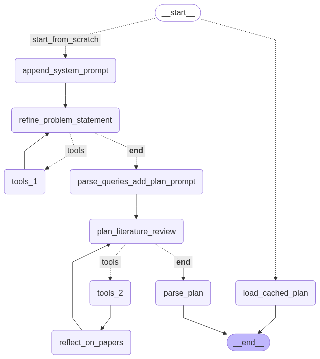

# Literature Review Agent

An autonomous multi-agent system built with LangGraph that generates comprehensive literature reviews from academic papers. Given a research topic, it searches the web and arXiv, plans the review structure, retrieves and synthesizes relevant papers, and produces a grounded, citation-verified literature survey.

## Architecture

The system consists of two main sub-agents orchestrated by a parent graph:

### Planning Agent
- Refines the research topic through human interaction
- Searches arXiv and web for relevant papers
- Creates a structured plan with sections and key points
- Maps papers to specific subsections

### Refinement Agent
- Processes each subsection sequentially
- Downloads papers and creates vector embeddings (ChromaDB)
- Generates content using RAG with relevant paper fragments
- Reviews content quality and grounding/citations
- Iteratively refines until quality standards are met

### Key Features
- **RAG-based writing**: Uses vector similarity search to retrieve relevant paper fragments
- **Citation verification**: Validates that claims are grounded in cited papers
- **Iterative refinement**: Content and grounding review loops until quality passes
- **Tool access**: LLM can search paper fragments during verification
- **Parallel processing**: Papers are processed concurrently where possible

## Graph Diagrams

### Main Graph


### Planning Sub-Graph


### Refinement Sub-Graph


## Installation

```bash
# Clone the repository
git clone <repo-url>
cd langgraph-research

# Install dependencies with Poetry
poetry install

# Set up environment variables
cp .env.example .env
# Edit .env with your API keys:
# - OPENROUTER_API_KEY (required)
# - TAVILY_API_KEY (for web search)
```

## Usage

```bash
# Run the literature review agent
poetry run python main.py
```

You'll be prompted to enter:
1. Research topic
2. Paper recency filter (e.g., "last 5 years")

The agent will then:
1. Search for relevant papers and create a review plan
2. Generate each subsection with proper citations
3. Review and refine content until quality standards are met
4. Output the final literature survey

## Project Structure

```
agents/
├── graph.py                    # Main orchestration graph
├── planning_agent/
│   ├── graph.py               # Planning subgraph
│   ├── agent_config.py        # Planning agent configuration
│   ├── nodes/                 # Planning nodes (refine topic, search, plan)
│   ├── tools.py               # arXiv search, web search, human input
│   └── prompts.py             # Planning prompts
├── refinement_agent/
│   ├── graph.py               # Refinement subgraph
│   ├── agent_config.py        # Refinement agent configuration
│   ├── nodes/                 # Writing, review, feedback, state management
│   ├── tools.py               # Paper fragment search tool
│   └── prompts.py             # Writing and review prompts
└── shared/
    ├── main_config.py         # Base configuration dataclass
    ├── state/                 # Pydantic state models
    └── utils/                 # LLM utils, callbacks, logging

data/
├── database/                  # SQLite for paper/review tracking
├── vector_store/              # ChromaDB vector collections
└── temp_cache/                # Temporary paper downloads

graph_diagrams/                # Generated workflow diagrams
```

## Configuration

Key settings in `agents/shared/main_config.py`:
- `orchestrator_model`: Main LLM for complex tasks
- `text_model`: LLM for content generation
- `embedding_model`: Model for vector embeddings

Agent-specific settings in `agents/*/agent_config.py`.
